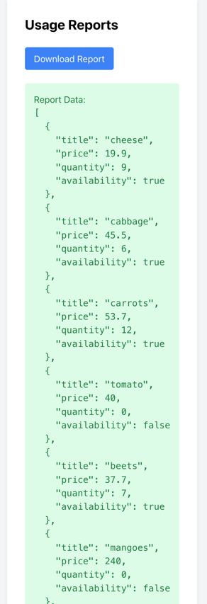

Запуск осуществляется командой:
```bash
docker compose up
```

Пример вывода репорта под юзером prothetic1@example.com:


Для локального запуска бэкенд сервиса6 необходимо переименовать .env.example в .env
